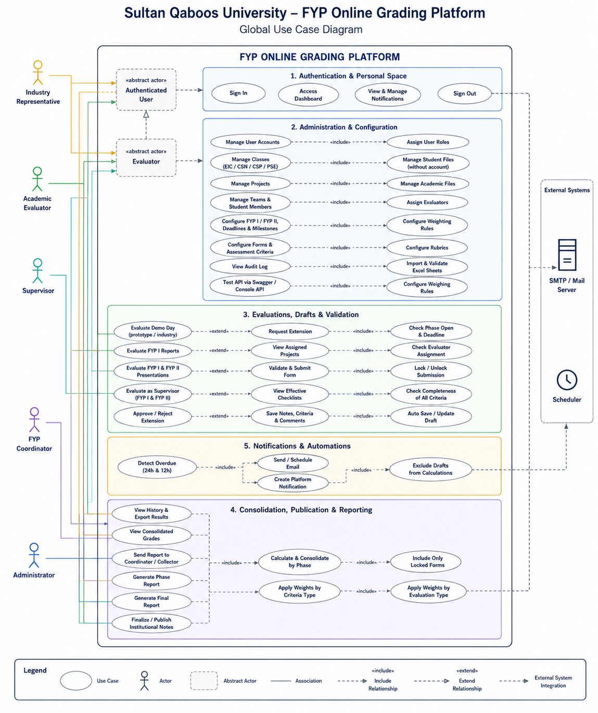
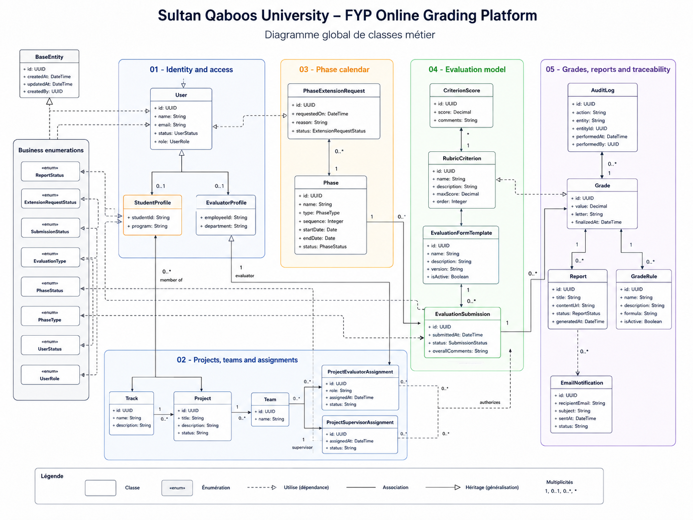

# FYP Online Grading Platform

A bilingual web platform for managing and grading Final Year Projects (FYP) at Sultan Qaboos University. It supports the complete academic workflow for FYP I and FYP II, from student-record imports and evaluator onboarding to project allocation, deadline-controlled evaluations, grade consolidation, publication, reporting, notifications, and audit tracking.

The repository is a production-oriented monorepo containing a React frontend, a Spring Boot backend, PostgreSQL persistence, an email testing service, and a Docker Compose environment.

## Project Purpose

Final Year Project assessment involves several actors, evaluation forms, deadlines, and grading rules. This platform centralizes those processes in one role-based system.


It is designed to:

- provide a dedicated dashboard for every actor;
- manage students, evaluators, tracks, projects, teams, and academic phases;
- import student and evaluator data from Excel files;
- assign supervisors and evaluators to projects;
- configure FYP I, FYP II, report, oral, and Demo Day evaluation forms;
- save evaluation work as a draft until the evaluator formally submits it;
- prevent late or unsubmitted drafts from affecting final grades;
- notify users before deadlines and allow extension requests;
- consolidate, publish, export, and report final grades;
- keep an audit trail of sensitive operations.

## Main Features

### Premium Bilingual Frontend

- Distinct role-aware dashboards for administrators, supervisors, faculty evaluators, industry representatives, and FYP coordinators.
- Responsive workspace for desktop, tablet, and mobile with an off-canvas mobile navigation.
- SQU-inspired visual identity with a professional academic photograph, carefully balanced institutional colors, and Lucide icons.
- Consistent light and dark themes saved across sessions.
- French and English interface switching across authentication, navigation, dashboards, forms, messages, and dynamic content.
- Global search with contextual navigation suggestions.
- Animated metrics, deadline progress, loading skeletons, empty states, error recovery, confirmations, notifications, and accessible drawers and modals.
- Existing routes, REST calls, permissions, and grading workflows preserved.
- Detailed implementation guide: [Premium frontend redesign](docs/REFONTE_FRONTEND_PREMIUM_FR.md).
### Authentication and Role-Based Access

- Login-based access for the five platform actors: administrators, supervisors, faculty evaluators, industry representatives, and FYP coordinators.
- Separate sessions and dashboards for each actor.
- Role-based navigation and API authorization.
- Automatic redirection to the correct workspace after login.

### Academic Data Management

- CRUD operations for user accounts, independent student records, evaluator profiles, tracks, projects, teams, phases, evaluation forms, rubric criteria, grades, notifications, and reports.
- Project-to-team allocation.
- Student-record membership management for project teams, without creating student accounts.
- Supervisor and evaluator assignments.
- Filtering and search across administrative resources.

### Excel Imports

- Import official SQU student lists using the exact `stdID`, `cohort`, `name`, and `Email` columns.
- Import academic and industry evaluator lists.
- Preview and validate rows before submission, with atomic persistence after successful validation.
- Create, update, or leave unchanged each student record by its unique SQU student ID.
- Detect missing values, duplicates, invalid cohort formats, and inconsistent SQU email addresses.
- Reusable blank Excel template included in the frontend public assets.
- Detailed French workflow: [Student import and Industry Guest evaluation guide](docs/IMPORT_ETUDIANTS_ET_EVALUATION_INDUSTRIE_FR.md).

### Phase and Deadline Management

- Manage FYP I and FYP II phases.
- Configure academic year, start date, deadline, duration, and status.
- Open, close, and archive phases.
- Block evaluation submission when a phase deadline has passed.
- Send reminders approximately 24 hours and 12 hours before a deadline.
- Allow evaluators to request an extension.
- Allow administrators to approve or reject extension requests.

### Evaluation Workflow

- Supervisor evaluations for FYP I and FYP II.
- Report evaluations for FYP I and FYP II.
- Oral presentation evaluations for FYP I and FYP II.
- Industry representative evaluation for Demo Day.
- Official Industry Guest sheet with the five criteria and 2/1/4/2/1 weighting supplied by SQU.
- Configurable forms and rubric criteria.
- Individual and team scoring support.
- Automatic draft saving.
- Explicit final submission and locking.
- Drafts that are not submitted before the deadline are excluded from official grading.

### Grading and Reporting

- Consolidate evaluation results using grading rules.
- Track pending, submitted, and locked evaluation sheets.
- Approve and publish grades for coordinator reporting and official academic records.
- Generate phase and final reports.
- Track report generation and email delivery.
- Provide coordinator and administrator views of overall progress.

### Notifications and Audit

- In-app notification center available to all actors.
- Deadline reminders and extension decision notifications.
- Development email capture through Mailpit.
- Audit logs for sensitive administrative actions.

### API Documentation

- Interactive OpenAPI documentation through Swagger UI.
- REST endpoints grouped by functional module.
- Standard API response structure and centralized error handling.

## User Roles

| Role | Main responsibilities |
| --- | --- |
| Administrator | Manages accounts, academic data, projects, teams, phases, assignments, evaluation templates, deadlines, extensions, grades, reports, and audit logs. |
| Supervisor | Evaluates supervised projects for FYP I and FYP II, saves drafts, submits final forms, and requests deadline extensions. |
| Faculty Evaluator | Evaluates reports and oral presentations for FYP I and FYP II and follows pending submissions. |
| Industry Representative | Evaluates prototypes and industry relevance during Demo Day. |
| FYP Coordinator | Monitors phase progress, consolidated grades, generated reports, exports, and delivery history. |

## Typical Workflow

1. The administrator creates accounts or imports academic data from Excel.
2. Tracks, projects, teams, and student memberships are configured.
3. Supervisors and evaluators are assigned to projects.
4. Evaluation forms, criteria, grading rules, phases, and deadlines are configured.
5. Evaluators enter scores and comments, which remain drafts until final submission.
6. The platform sends approaching-deadline notifications.
7. Evaluators may request an extension when necessary.
8. Submitted evaluations are locked and included in grade consolidation.
9. Administrators review, finalize, and publish grades for institutional processing.
10. Coordinators review consolidated results and generate reports and exports.

## Technology Stack

| Layer | Technology |
| --- | --- |
| Frontend | React 19, Vite, JavaScript, CSS, Lucide icons |
| Frontend production server | Nginx |
| Backend | Spring Boot 3.5, Java 21 LTS, Maven |
| Persistence | Spring Data JPA, Hibernate, PostgreSQL 18 |
| API documentation | Springdoc OpenAPI and Swagger UI |
| Email testing | Mailpit |
| Deployment | Docker and Docker Compose |
| Testing | JUnit, Mockito, Testcontainers, ESLint, Vite build |

## Repository Structure

```text
.
|-- backend/                 Spring Boot application
|   |-- src/main/java/      Backend modules and REST APIs
|   |-- src/test/java/      Unit and integration tests
|   |-- Dockerfile          Java 21 multi-stage image
|   `-- pom.xml             Maven configuration
|-- frontend/                React application
|   |-- src/                Dashboards, forms, API client, and translations
|   |-- public/             Public assets and Excel import template
|   |-- Dockerfile          Node build and Nginx runtime image
|   `-- nginx.conf          SPA and /api reverse proxy
|-- compose.yaml             Complete local environment
|-- .env.example             Environment variable template
`-- README.md                Main project documentation
```

## Architecture

```text
Browser
   |
   v
Nginx / React frontend
   |
   | /api
   v
Spring Boot REST API
   |               |
   v               v
PostgreSQL       Mailpit
```

Nginx forwards `/api` requests to Spring Boot. The browser therefore communicates with a single origin in the Docker environment, avoiding hard-coded backend URLs and CORS issues.

The backend is organized into domain modules for authentication, users, projects, evaluations, grading, notifications, reporting, dashboards, and auditing.

## UML Documentation

The complete UML documentation is available in [`docs/uml`](docs/uml/README_FR.md):

- [global use-case diagram (SVG)](docs/uml/use-case-global.svg);
- [global class diagram (SVG)](docs/uml/class-diagram-global.svg);
- [two-page UML document (PDF)](docs/uml/fyp-uml-diagrams.pdf);
- editable Graphviz and PlantUML source files.

### Diagram Previews

#### Global Use Case Diagram



#### Global Class Diagram



## Quick Start with Docker

### Prerequisites

Install:

- Git;
- Docker Desktop with Docker Compose.

### Installation

```bash
git clone https://github.com/ranym-eng/FYP-Online-Grading-Platform.git
cd FYP-Online-Grading-Platform
docker compose up --build -d
```

The first startup can take several minutes while Docker downloads the base images and builds both applications.

Check the service status:

```bash
docker compose ps
```

All four services should eventually report a running or healthy status.

## Service URLs

| Service | URL |
| --- | --- |
| React application | http://localhost:3000 |
| Spring Boot API | http://localhost:8080 |
| Swagger UI | http://localhost:8080/swagger-ui.html |
| Backend health | http://localhost:8080/actuator/health |
| Mailpit web interface | http://localhost:8025 |
| PostgreSQL from the host | localhost:5433 |

## Default Development Account

An administrator account is created automatically:

```text
Email:    admin@squ.edu.om
Password: Admin@123
```

These credentials are intended only for local development. Replace them before deploying the platform to a shared or production environment.

## Docker Commands

Show service status:

```bash
docker compose ps
```

Follow all logs:

```bash
docker compose logs -f
```

Follow only the backend logs:

```bash
docker compose logs -f backend
```

Rebuild after source changes:

```bash
docker compose up --build -d
```

Stop the services while keeping PostgreSQL data:

```bash
docker compose down
```

Stop the services and permanently remove the Docker database:

```bash
docker compose down -v
```

The `-v` option permanently deletes the Docker PostgreSQL volume.

## Environment Configuration

The application can run without a `.env` file because development defaults are defined in `compose.yaml`.

To customize credentials or ports on Windows PowerShell:

```powershell
Copy-Item .env.example .env
```

On macOS or Linux:

```bash
cp .env.example .env
```

Available variables:

| Variable | Default value |
| --- | --- |
| `POSTGRES_DB` | `fyp_grading_platform` |
| `POSTGRES_USER` | `postgres` |
| `POSTGRES_PASSWORD` | `root` |
| `POSTGRES_PORT` | `5433` |
| `BACKEND_PORT` | `8080` |
| `FRONTEND_PORT` | `3000` |
| `MAILPIT_SMTP_PORT` | `1025` |
| `MAILPIT_UI_PORT` | `8025` |
| `MAIL_FROM` | `no-reply@squ.edu.om` |

PostgreSQL uses host port `5433` by default to avoid conflicts with an existing local PostgreSQL installation on `5432`. Inside Docker, Spring Boot connects to the PostgreSQL service on the standard port `5432`.

Never commit a real `.env` file or production credentials. The `.env` file is excluded by `.gitignore`.

## Running without Docker

### Backend

Requirements:

- Java 21;
- PostgreSQL;
- a database named `fyp_grading_platform`.

Windows PowerShell:

```powershell
cd backend
$env:SPRING_DATASOURCE_URL="jdbc:postgresql://localhost:5432/fyp_grading_platform"
$env:SPRING_DATASOURCE_USERNAME="postgres"
$env:SPRING_DATASOURCE_PASSWORD="root"
.\mvnw.cmd spring-boot:run
```

### Frontend

Requirement: Node.js 22 or later.

```powershell
cd frontend
npm ci
npm run dev
```

During local development, Vite proxies `/api` requests to `http://localhost:8080`.

## Tests and Quality Checks

Backend:

```powershell
cd backend
.\mvnw.cmd test
```

Frontend:

```powershell
cd frontend
npm ci
npm run lint
npm run build
```

Testcontainers-based integration tests require Docker to be running.

Validate the Docker Compose configuration:

```bash
docker compose config
```

## Data and Email Handling

- Hibernate creates and updates the PostgreSQL schema at startup.
- Docker database data is persisted in the `postgres_data` volume.
- Development emails are captured by Mailpit and can be inspected at http://localhost:8025.
- The backend can be configured to use a real SMTP server through environment variables for deployment.

## Troubleshooting

### A port is already in use

Create a `.env` file, change the conflicting port, and restart:

```bash
docker compose up --build -d
```

### The backend cannot connect to PostgreSQL

Check container health and backend logs:

```bash
docker compose ps
docker compose logs backend
docker compose logs postgres
```

### Start with an empty Docker database

```bash
docker compose down -v
docker compose up --build -d
```

### Validate the generated Compose configuration

```bash
docker compose config
```

## Security Notice

The default database password and administrator account are development defaults. A real deployment must use strong secrets, HTTPS, restricted network access, secure SMTP credentials, regular backups, and a reviewed production authentication strategy.
