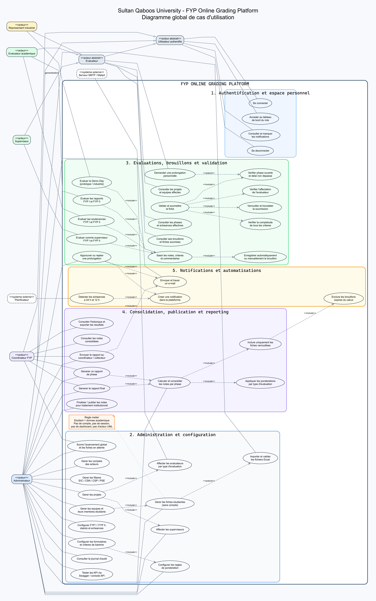

# Diagrammes UML globaux du projet FYP

Cette documentation presente le modele fonctionnel et le modele de classes de la plateforme de notation des Final Year Projects.

## Regle metier fondamentale

**L'etudiant n'est pas un acteur de la plateforme.**

Un etudiant :

- ne possede pas de compte `User` ;
- ne se connecte pas ;
- ne possede ni session ni tableau de bord ;
- ne recoit pas de role RBAC ;
- est importe ou cree comme fiche academique `StudentProfile` ;
- est rattache a une ou plusieurs equipes ;
- peut etre une cible de notation individuelle dans une fiche d'evaluation.

Les cinq acteurs connectes sont :

1. Administrateur ;
2. Superviseur ;
3. Evaluateur academique ;
4. Representant industriel ;
5. Coordinateur FYP.

Le planificateur et le serveur SMTP sont representes comme des systemes externes, pas comme des utilisateurs humains.

## Diagramme global de cas d'utilisation

Le diagramme couvre :

- l'authentification, les sessions et les dashboards par role ;
- la gestion des comptes des acteurs ;
- la gestion des fiches etudiantes sans compte ;
- les imports Excel avec validation ;
- les filieres, projets, equipes et affectations ;
- les phases FYP I et FYP II, leurs statuts et leurs echeances ;
- les formulaires, criteres et ponderations ;
- les evaluations superviseur, rapport, soutenance et Demo Day ;
- la sauvegarde en brouillon, la validation, le verrouillage et l'horodatage ;
- l'exclusion des brouillons expires ;
- les demandes et decisions de prolongation ;
- les rappels a 24 heures et 12 heures ;
- la consolidation, la finalisation, les rapports et les exports ;
- les notifications internes, les e-mails et l'audit.

## Diagramme global de classes

Le diagramme contient :

- les 19 entites persistantes et leur superclasse commune ;
- les attributs principaux de chaque entite ;
- toutes les cardinalites JPA importantes ;
- les entites d'affectation superviseur et evaluateur ;
- les formulaires, criteres, soumissions et scores ;
- les phases et prolongations personnelles ;
- les notes, regles, rapports, notifications et traces d'audit ;
- les huit enumerations metier ;
- les principaux services d'authentification, evaluation, delai, calcul, reporting, notification et audit.

## Fichiers fournis

| Fichier | Utilisation |
| --- | --- |
| `use-case-global.svg` | Version vectorielle du diagramme de cas d'utilisation. |
| `use-case-global.png` | Image haute resolution du diagramme de cas d'utilisation. |
| `use-case-global.dot` | Source Graphviz ayant servi au rendu. |
| `use-case-global.puml` | Source PlantUML editable. |
| `class-diagram-global.svg` | Version vectorielle du diagramme global de classes. |
| `class-diagram-global.png` | Image haute resolution du diagramme global de classes. |
| `class-diagram-global.dot` | Source Graphviz ayant servi au rendu. |
| `class-diagram-global.puml` | Source PlantUML editable. |
| `fyp-uml-diagrams.pdf` | PDF de deux pages contenant les deux diagrammes. |

## Legende UML

- Trait plein : association metier ou relation avec un acteur.
- Losange plein : composition, le cycle de vie de la partie depend du parent.
- Losange vide : agregation.
- Fleche pointillee : dependance de service ou relation logique par identifiant.
- `<<include>>` : sous-fonction obligatoire du cas d'utilisation principal.
- `<<extend>>` : comportement conditionnel ou optionnel.
- `0..1`, `1`, `0..*`, `1..*` : cardinalites des associations.

## Verification de coherence

Le modele a ete aligne avec le code Spring Boot et React :

- `UserRole` ne contient pas `STUDENT` ;
- `StudentProfile` n'a aucune association vers `User` ;
- seuls les acteurs autorises disposent d'un dashboard ;
- seules les soumissions verrouillees sont consolidees ;
- les brouillons non soumis avant l'echeance sont ignores ;
- les prolongations approuvees definissent une echeance personnelle ;
- les rappels sont dedupliques et distribues dans le centre de notifications.
